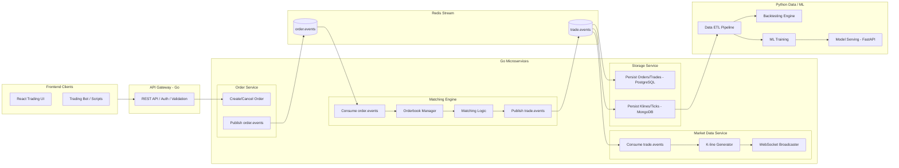

# 🌐 Mercury Exchange System  
## A Distributed Mini Trading Exchange + Real-Time Market Visualization  
**Go Microservices + Redis Stream + PostgreSQL + MongoDB + Python Data/ML + React Frontend**

---

# 🟩 1. 專案願景（Project Vision）

Mercury 是一套「可展示後端工程能力的迷你分散式交易系統」，  
結合：

- **撮合引擎**
- **Orderbook / 成交事件流**
- **WebSocket 即時行情**
- **K 線圖表（Mini TradingView）**
- **前端 React 交易界面**
- **Python 資料處理 / 回測 / ML pipeline**

此專案的目的不僅是做出一個「可運作的交易平台」，  
更重要的是展示 **大型後端工程師所需的架構能力**：

- 微服務拆分  
- 分散式事件架構  
- Redis Stream / MQ  
- 可觀測性（Prometheus）  
- Docker / K8s 部署  
- 統一網關  
- React 前端整合  

---

# 🟦 2. 主要開發目標（Development Goals）

## 🎯 **核心系統目標**
1. **高效能撮合引擎（Go）**  
   - Limit, Market, IOC  
   - Price-time priority  
   - 單執行緒 deterministic matching

2. **分散式事件流架構**  
   - Redis Stream  
   - order.events → matching → trade.events

3. **多服務微服務架構（Go）**  
   - Order Service  
   - Matching Engine  
   - Market Data Service  
   - Storage Service  
   - API Gateway

4. **WebSocket 實時行情推播（Go）**  
   - Orderbook Snapshot  
   - Delta updates  
   - Trade Feed  
   - K 線推播（1s, 1m）

5. **React + TypeScript 前端（Mini TradingView）**  
   - Orderbook 面板  
   - 成交紀錄  
   - Depth Chart  
   - K 線圖（lightweight-charts）  
   - 下單介面

6. **Python Data / ML 能力（加分項）**  
   - ETL pipeline（整理 Tick/Kline）  
   - Backtesting  
   - 小型 ML 模型（方向預測）  
   - FastAPI inference API

---

# 🟥 3. 系統架構（Architecture Overview）

## 📌 「Go 作為主力後端，Python 作為資料輔助」的分散式架構

---

# 🟨 4. 服務職責（Service Responsibilities）

## 4.1 API Gateway (Go)

- 單一入口
- 驗證/限制流量
- 轉發至 Order Service
- 收集 metrics

---

## 4.2 Order Service (Go)

- 收下單 / 撤單指令
- 寫入 PostgreSQL（異步）
- 發布 order.events
- 不做撮合（保持解耦）

---

## 4.3 Matching Engine (Go)

- Consumes order.events
- 單執行緒 deterministic matching
- 更新 orderbook
- 發布 trade.events

**Matching Algorithm:**

- FIFO within same price
- Price-Time Priority
- Partial fill
- Cancel support

---

## 4.4 Market Data Service (Go)

- 建立 orderbook / trade snapshot
- 產生 K 線
- 廣播 snapshot/delta via WebSocket
- 提供前端即時行情

---

## 4.5 Storage Service (Go)

**PostgreSQL（強一致性用途）**

- orders
- trades

**MongoDB（高頻資料用途）**

- ticks
- klines

---

# 🟫 5. Python Data / ML Subsystem

## 5.1 Data Pipeline (Pandas)

- 讀取 MongoDB
- 清洗 tick/kline
- 製作 backtesting 資料集

## 5.2 Backtesting Engine

- 用歷史 K 線回測策略
- 計算報酬/最大回撤

## 5.3 ML Training（選擇性）

- Logistic Regression
- RandomForest
- Features: return, volume，技術指標等

## 5.4 ML Serving

- FastAPI endpoint
- 可被前端或後端使用

---

# 🟦 6. 前端 React（Mini TradingView）

**使用技術：**

- React + TypeScript
- Zustand / Redux
- Lightweight-charts（TradingView SDK）
- ECharts（Depth Chart）
- WebSocket for real-time updates

**前端頁面包含：**

- Orderbook（買賣盤）
- Trades List（成交紀錄）
- K 線圖（1m, 5m, 15m）
- 深度圖（Depth Chart）
- 下單面板

---

# 🟩 7. 技術棧（Tech Stack Summary）

| Layer | Tech |
|-------|------|
| Backend Core | Go |
| Data / ML | Python |
| API | FastAPI（ML）、Go REST（核心） |
| Realtime | Go WebSocket |
| Message Queue | Redis Stream |
| Database | PostgreSQL + MongoDB |
| Frontend | React + TypeScript |
| Deployment | Docker / K8s |
| Observability | Prometheus + Grafana |

---

# 🟧 8. 開發階段（Milestones）

## Phase 1：Mini Exchange Core（2–3 weeks）

- [ ] 撮合引擎
- [ ] Order API
- [ ] WebSocket 行情
- [ ] React UI 基本版
- [ ] docker-compose

## Phase 2：Market Visualization（1–2 weeks）

- [ ] K 線生成與推播
- [ ] Depth Chart
- [ ] TradingView-like UI

## Phase 3：Python Data/ML（1–2 weeks）

- [ ] ETL Pipeline
- [ ] Backtesting
- [ ] ML inference API

## Phase 4：Kubernetes Deployment（1–2 weeks）

- [ ] 部署 microservices
- [ ] Prometheus metrics
- [ ] Rolling update

---

# 🟥 9. Portfolio Value（履歷亮點）

完成後你可以寫：

**Backend (Go):**

> Designed and implemented a distributed trading backend consisting of multiple Go microservices communicating via Redis Stream, including an event-driven matching engine, market data service, and API gateway.

**Frontend (React):**

> Built a real-time trading UI with orderbook, trades, depth chart, and TradingView-style candlestick charts using WebSocket streaming.

**Data/ML (Python):**

> Developed a data pipeline and lightweight ML prediction service for market analysis using FastAPI and scikit-learn.

這會讓你直接達到 **外商後端工程師 / 系統工程師** 層級。

---

# 🟪 10. 未來可擴展功能（Future Scope）

- 多交易對（BTC/ETH/AAPL）
- Kafka event pipeline
- gRPC 服務內通訊
- 資金/餘額系統
- 高可用撮合（Active-Standby）
- ML 自動訓練 pipeline（Airflow）

---

# 🎉 融合版完成！

這份文件已經將：

- ✅ 你的原始產品願景
- ✅ 生產級後端架構
- ✅ Go 主力、Python 輔助
- ✅ React 技能展示
- ✅ 面試所需的工程深度

全部融合成一個 **強到可以放履歷首頁的專案**。

---

# 📋 接下來你想做哪一步？

| # | 選項 |
|---|------|
| 1️⃣ | 生產級資料夾結構（Go + Python + React） |
| 2️⃣ | 完整 API Spec（REST + WS） |
| 3️⃣ | 撮合引擎技術細節文件 |
| 4️⃣ | 3 個月 Roadmap（每週任務） |
| 5️⃣ | 面試講解稿（1 分鐘 / 5 分鐘 / 15 分鐘版本） |